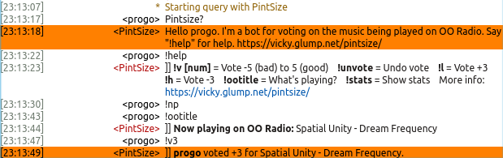

# Music Stream Vote #

**Music Stream Vote** is an application for collecting votes on the currently playing track on any Internet radio station running Icecast that has an IRC chat room and a WordPress web site.

## Features ##

* Poll IceCast ``.xspf`` URL for name of currently playing track every *n* seconds.
* Announce track changes in an IRC chat room and post them to WordPress.
* Allow chat room users to post votes from -5 to +5 on each played track. (One vote per person per play, undoable and changeable.)
* Configurable IRC commands and responses (enable, disable, change response text) for "Say hi", "Help", "Vote", "Unvote", "Now Playing", and "Stats".
* Report Top 10 tracks in chat room.
* Report Top 100 tracks and last 24 hours of play on web site.
* Search form allows web site visitors to query voting history.
* HTML5 audio player with current and recent track titles displayed.

## Requirements ##

* An Internet radio station running software like IceCast that provides a "Now Playing" [XSPF](https://en.wikipedia.org/wiki/XML_Shareable_Playlist_Format) file at a static URL.
* An IRC chat room where you have *permission* to run a bot.
* A WordPress web site.
    * PHP 5.4+ (WordPress requires 5.2.4 but Music Stream Vote requires 5.4).
    * MySQL 5.0+.
    * ``php5-json`` package (doesn't come with PHP by default in some operating systems)
* A host to run the IRC bot -- preferably the same as the WordPress site, but not necessarily.
    * PHP 5.4+
    * Linux or a Unix OS on the bot host. Not a strict requirement, but at the moment the control script and instructions will require some expertise to adapt it to Windows.
    * ``php5-json`` and ``php5-curl`` packages (don't come with PHP by default in some operating systems)

## History ##

Development on Music Stream Vote started in October 2013 in the chat room for [RynoTheBearded's OO Show](http://rynothebearded.com/) on [No Agenda Global Radio](http://www.nagradio.com/)'s chat server ZeroNode (Channel "#OO"). RynoTheBearded was looking for an efficient way to collect votes for an end of the year top 10 countdown show.

I saw that he was using WordPress to run the web site and knew it would provide a good framework to build a data collection application. Since we were already using PHP for the data collection backend in WordPress, I chose the [PHP-IRC framework](http://www.phpbots.org/) to build the bot to talk in the chat room.

Music Stream Vote debuted on the weekly OO Show with the name PintSize in "#OO" on ZernoNode on 8 November 2013.

The first "stable" release, version 1.1, will be released in November 2013.
